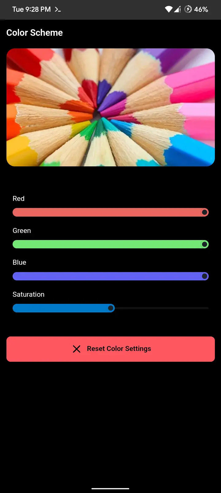

# Color Scheme
Display color calibration with SurfaceFlinger.

No kernel-level support needed (eg. kcal, live display...).

## Supported Root Managers
- [APatch](https://github.com/bmax121/APatch) 
- [KernelSU](https://github.com/tiann/KernelSU)
- [Magisk](https://github.com/topjohnwu/Magisk)  ([no WebUI](https://github.com/topjohnwu/Magisk/issues/8609#event-15568590949)👀)

### WebUI on Magisk
Magisk doesn't support module WebUI on their manager, but you can use one of these app to open Color Scheme WebUI.

- [KsuWebUI](https://github.com/5ec1cff/KsuWebUIStandalone)
- [MMRL](https://github.com/DerGoogler/MMRL)   👍

## Usage
- Flash Color Scheme Module
- Reboot
- Open Color Scheme WebUI
- Change color settings you wanted. Changes are applied immediately, no need to reboot.

## Screenshot

## Links
- Download [here](https://github.com/Rem01Gaming/color_scheme/releases)
- [Telegram Channel](https://t.me/rem01schannel)

## Help and Support
Report [here](https://github.com/Rem01Gaming/color_scheme/issues) if you encounter any issues.

[Pull requests](https://github.com/Rem01Gaming/color_scheme/pulls) are always welcome.
